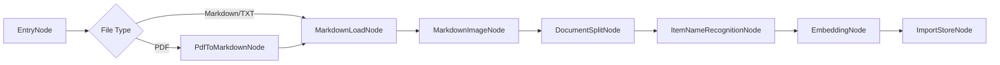

# Architecture

## Import Pipeline

IKB-Agent uses LangGraph to keep the import pipeline observable and extensible.
Nodes are split into independent modules under `ikb_agent/pipeline/nodes`,
matching the original course structure where each node owns a single business
step.



## State Contract

The pipeline passes a single state object across nodes:

```text
import_file_path
file_title
md_path
md_content
chunks
item_name
trace
task_id
```

Each node reads a small subset and writes its own output. This makes every node independently testable.

## Task Tracking

Every import request creates an `ImportTaskRecord`. The API updates it from
`processing` to `completed` or `failed`, stores progress, and persists the
LangGraph node trace:

```text
entry_node -> markdown_load_node -> md_image_node -> document_split_node
  -> item_name_recognition_node -> bge_embedding_chunks_node -> milvus_import_node
```

The current implementation stores tasks in the local JSON store. In production,
the same record can be moved to Redis, MySQL, or MongoDB.

## Retrieval

The local store implements a simple hybrid score:

```text
score = 0.64 * dense_cosine + 0.36 * sparse_overlap
```

Production systems can replace this with Milvus hybrid search and BGE-M3 vectors while keeping the same chunk schema.

## Project Layers

```text
ikb_agent/
  api/          FastAPI routers: import, query, health, tasks
  services/     Business orchestration for import/query/task APIs
  schema/       Request and response schemas exposed to the API layer
  pipeline/     LangGraph import workflow and node implementations
  processor/    Courseware-compatible graph entry package
  utils/        Optional integrations: Milvus, MinIO, MongoDB, LLM, SSE
  static/       Interview demo frontend
```

The default local mode keeps all data in `data/knowledge_store.json`. The
production-oriented utilities are intentionally separate from the local store,
so a developer can test the whole document-processing flow before installing
Docker or GPU-heavy model dependencies.

## Middleware Mapping

| Responsibility | Local mode | Production mode |
| --- | --- | --- |
| Original files and images | `data/uploads` | MinIO |
| Chunk records | JSON store | Milvus scalar fields + metadata |
| Dense vectors | local hash vector | BGE-M3 dense vector in Milvus |
| Sparse vectors | token overlap map | BGE-M3 sparse vector / hybrid retrieval |
| Task trace and chat history | JSON store | MongoDB |
| Image understanding | Markdown alt text fallback | Qwen3-VL-Flash |
| Product/entity extraction | heuristic recognizer | Qwen LLM extraction |
