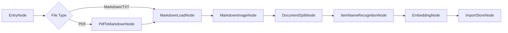

# Architecture

## Import Pipeline

IKB-Agent uses LangGraph to keep the import pipeline observable and extensible.



## State Contract

The pipeline passes a single state object across nodes:

```text
import_file_path
file_title
md_path
md_content
chunks
item_name
trace
```

Each node reads a small subset and writes its own output. This makes every node independently testable.

## Retrieval

The local store implements a simple hybrid score:

```text
score = 0.64 * dense_cosine + 0.36 * sparse_overlap
```

Production systems can replace this with Milvus hybrid search and BGE-M3 vectors while keeping the same chunk schema.

